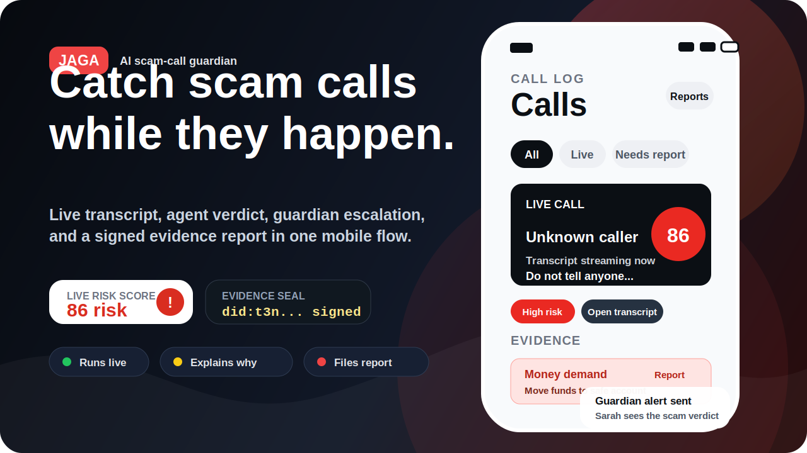
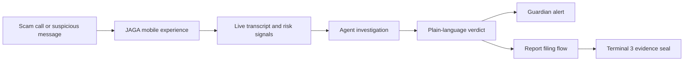

<p align="center">
  
</p>

<h1 align="center">JAGA</h1>

<p align="center">
  <strong>AI scam-call guardian that catches fraud during the call, explains the evidence, alerts a trusted contact, and files a signed report.</strong>
</p>

<p align="center">
  <a href="https://jagacustomer.vercel.app/"><strong>Live Demo</strong></a>
  |
  <a href="agent-forge-hackathon/docs/jaga-architecture.md">Architecture Notes</a>
  |
  <a href="agent-forge-hackathon/docs/judging-strategy.md">Judging Strategy</a>
</p>

<p align="center">
  
  
  
  
</p>

## What This Is

JAGA turns a scam call into an explainable, reportable incident while the victim still has time to stop. The app listens to the call flow, surfaces risk signals in plain language, keeps the evidence moments, alerts a trusted guardian, and produces a signed report trail.

This is built for the most stressful moment in a scam: when the caller is live, urgent, and pressuring someone to move money.

## Why Judges Should Care

| Criterion | Why JAGA scores |
| --- | --- |
| Completeness | Deployed mobile-first demo with onboarding, call log, live transcript, investigation, verdict, report, evidence seal, guardian alert, and settings screens. |
| Real-life problem | Scam calls are high-pressure, time-sensitive, and especially hard for older or less technical users to evaluate alone. |
| Innovation | Not another chatbot. JAGA is an agentic safety loop: detect, explain, escalate, preserve evidence, and report. |
| Sponsor fit | Terminal 3-style evidence signing is visible in the product flow; the hackathon stack includes Twilio, Supabase, VideoDB-style media evidence, and link-investigation adapters for Bright Data, Daytona, and TokenRouter. |

## Demo Flow

1. Open the [live demo](https://jagacustomer.vercel.app/).
2. Enter the call log and watch a live unknown caller get scored as high risk.
3. Open the transcript to see the exact scam language JAGA flagged.
4. Continue to the investigation and verdict screens to see why the call is unsafe.
5. File the report and watch the evidence manifest get hashed and sealed.
6. Show the guardian alert: the trusted contact gets the same high-risk context without needing to understand the technical details.

## Product Highlights

- Real-time call risk UI with a clear score, status, and next action.
- Evidence moments that preserve the exact scam phrases, such as money movement and secrecy pressure.
- Link and message checking path for suspicious SMS, URLs, or recordings.
- Guardian flow for family safety: JAGA alerts a trusted person when a scam is likely.
- Terminal 3-inspired evidence seal that hashes transcript, findings, and recording references in-browser.
- Multilingual-ready settings for English, Chinese, and Malay.
- Mobile-first design that looks like a real consumer safety app, not a hackathon dashboard.

## System Shape



## Tech Stack

| Layer | Stack |
| --- | --- |
| Frontend demo | React 19, Vite, React Router, Tailwind CSS 4 |
| Deployed app | Vercel |
| Live-call prototype | Twilio Voice, Twilio transcription events, Supabase edge functions |
| Media evidence path | VideoDB-style call recording evidence model |
| Link investigation path | `/api/investigate-link` client for Bright Data, Daytona, and TokenRouter-backed checks |
| Trust layer | Browser SHA-256 evidence manifest plus Terminal 3 DID-style signed receipt UI |

## Repo Map

```text
.
|-- src/                         # Deployed judge-facing React/Vite app
|   |-- screens/                 # Onboarding, call log, transcript, verdict, report, guardian
|   |-- lib/jaga.js              # Link investigation client and verdict routing
|   `-- lib/t3.js                # Evidence hashing and Terminal 3-style receipt data
|-- agent-forge-hackathon/
|   |-- mobile/                  # Twilio/Supabase live-call prototype
|   |-- supabase/functions/      # Voice, recording, transcription, and evidence functions
|   `-- docs/                    # Architecture, PRDs, runbooks, judging strategy
`-- docs/readme-hero.svg         # Judge-facing README hero
```

## Run Locally

```bash
npm install
npm run dev
```

The root app is the deployed visual demo. The `agent-forge-hackathon/mobile` workspace contains the deeper Twilio/Supabase prototype and has its own package scripts.

## The One-liner

JAGA is a scam-call co-pilot for families: it catches the fraud pattern, shows the proof, alerts someone trusted, and turns the call into a signed report before the damage is done.
