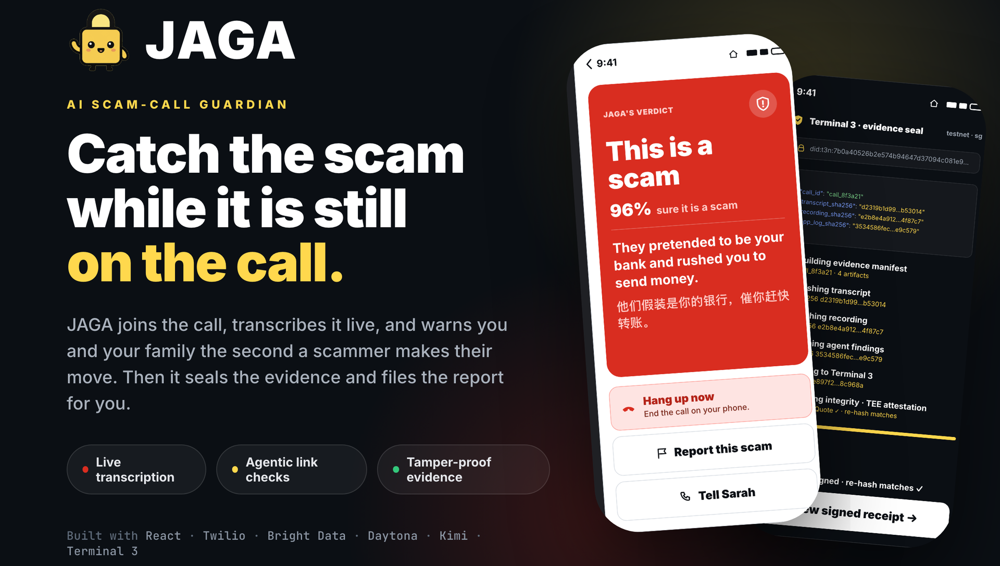
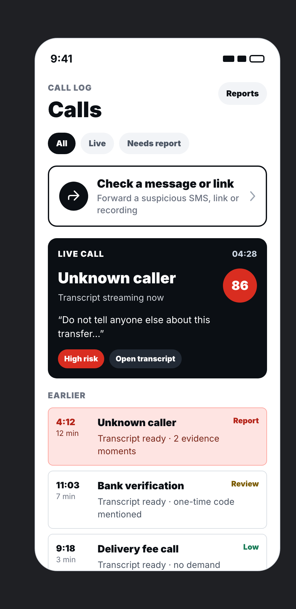
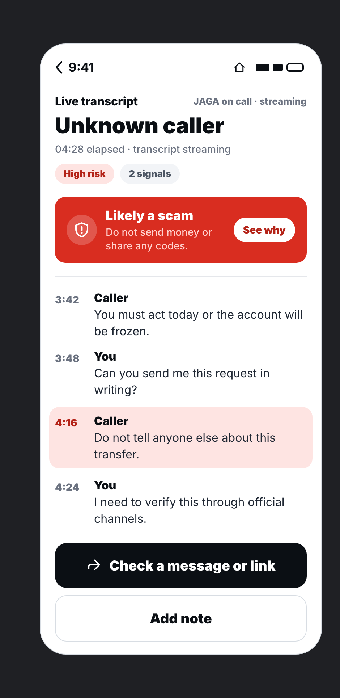
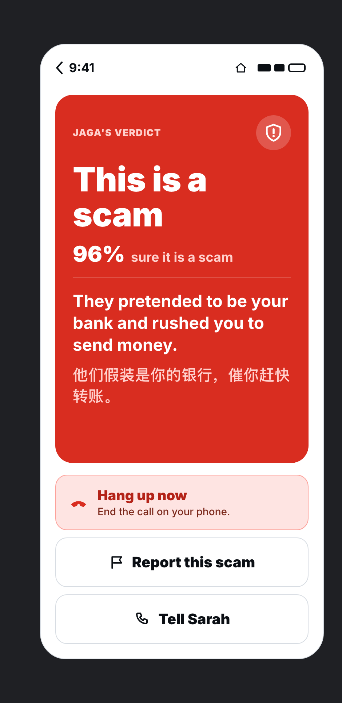
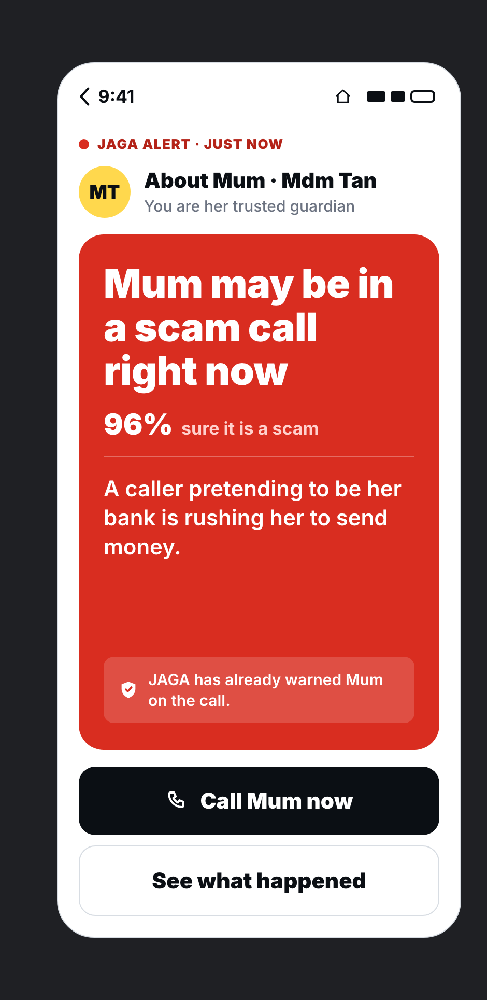
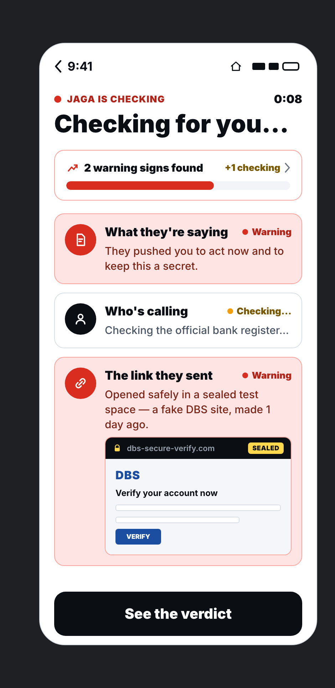
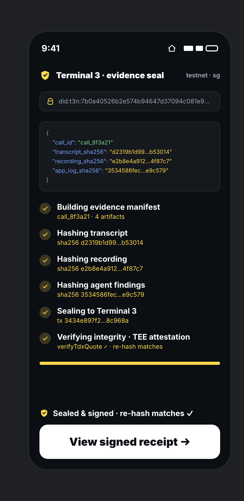
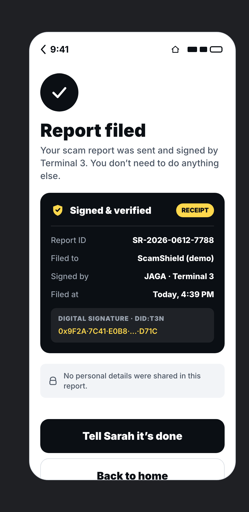

<div align="center">



# JAGA

**An AI guardian that catches phone scams while the call is still happening.**

[](https://jagacustomer.vercel.app/)
[](https://jaga-mobile-web.vercel.app/)

<br/>


</div>

---

## The problem

Every day, someone's parent picks up the phone and a stranger talks them out of their
savings. The caller sounds like the bank. They sound urgent. They say to move money to a
"safe account," to read out a code, to keep it quiet. By the time family finds out, the
money is gone.

The victims are rarely careless. They are elderly, or new to the country, or simply caught
off guard on a normal afternoon, alone on a call with someone trained to rush them.

**JAGA puts a guardian on that call.**

## What it does

JAGA is a number you add to your phone. It quietly joins your calls, transcribes them in
real time, and watches for the patterns scammers use. When it sees one, it acts.

<table>
<tr>
<td width="33%"></td>
<td width="33%"></td>
<td width="33%"></td>
</tr>
<tr>
<td align="center"><b>Live detection.</b> The call log scores a call as it streams in.</td>
<td align="center"><b>Live transcript.</b> Every line is read as it is spoken. Danger lights up.</td>
<td align="center"><b>A verdict you can read.</b> "This is a scam," in plain English and 中文.</td>
</tr>
</table>

## How it works

**1. Guard the call.** JAGA joins over Twilio, transcribes live, and scores the call as it
happens. The moment it reads a scam pattern, it warns the person on the line and alerts their
trusted guardian.

**2. Check a link or message.** Forward any suspicious SMS or link. An agent opens it inside a
Daytona sandbox, a sealed test space, while Bright Data pulls the real page. Kimi reads the
transcript and the page together and returns a risk score from 0 to 100 with findings. You see
the fake site captured safely, never on your own phone.

**3. Seal the evidence.** JAGA writes a plain-language report, then hashes the transcript,
recording, and findings into an evidence manifest. The SHA-256 is computed for real in your
browser. The manifest is sealed and signed through Terminal 3 with a `did:t3n` identity and a
TEE attestation, then filed. You keep a signed receipt, and no personal details ever leave.

<table>
<tr>
<td width="25%"></td>
<td width="25%"></td>
<td width="25%"></td>
<td width="25%"></td>
</tr>
<tr>
<td align="center">Family is alerted</td>
<td align="center">Link opened in a sandbox</td>
<td align="center">Real SHA-256 evidence seal</td>
<td align="center">Signed, filed receipt</td>
</tr>
</table>

## Under the hood

| Layer | Tech | What it does |
|---|---|---|
| App | React 19, Vite 8, Tailwind v4, React Router 7 | One connected demo app, one route per screen, built on a strict design system |
| Voice | Twilio | JAGA's number joins the call and streams the live transcript |
| Link agent | Bright Data, Daytona, Kimi (via TokenRouter) | Detonates suspicious links in a sandbox, scrapes the real page, scores the risk |
| Evidence | Terminal 3 (t3n) | In-browser SHA-256 manifest, `did:t3n` signature, TEE attestation, signed receipt |
| Languages | English, 中文, Melayu | Verdicts are written for the people most often targeted |

The link agent runs as a service on `:8000`. The app proxies `/api/*` to it in dev and falls
back to a static demo when it is offline, so the flow never breaks in front of an audience.

## Dig deeper

- [Architecture notes](agent-forge-hackathon/docs/jaga-architecture.md)
- [Judging strategy](agent-forge-hackathon/docs/judging-strategy.md)
- [Live flow PRD](agent-forge-hackathon/docs/jaga/PRD-1-live-flow.md) · [Report flow PRD](agent-forge-hackathon/docs/jaga/PRD-2-report-flow.md) · [Police reporting PRD](agent-forge-hackathon/docs/jaga/PRD-3-police-reporting-flow.md)

## Run it locally

```bash
npm install
npm run dev        # http://localhost:5173
```

The app runs fully on its own with demo data. To wire up the live link agent, run that service
on `:8000` and the dev proxy will pick it up.

## Built for AGENTFORGE AI

Team **JAGA**

- Lim Yee Han
- Ade Nat Lim
- Hosan Swee
- Mell Gao

JAGA means "to guard, to watch over." That is the whole idea.
